# Vali — the builder behind Mindforge

**Mechanic. Entrepreneur. Building with AI.**

I run an automotive workshop and build software alongside it. **Mindforge** is where
those ideas take shape: apps for everyday life, tools for creators, and software
for the work behind the scenes.

[Explore the projects](#selected-work) [Inside the toolbench](#the-toolbench) [My story](#my-story) [Say hello](#say-hello)

> Real problems from the workshop. New possibilities with AI.

## Selected work

**Open a project to look inside.** Products, experiments and collaborations — including
work that lives locally, not only on GitHub. These are development projects, not
claims that every feature is finished or publicly available.

<!-- NOW:START -->
Recent local work: **Trainic** for fitness and nutrition, **Atelier** for trading research,
and **Atlas** for working with AI models on Windows.
<!-- NOW:END -->

<strong>Trainic</strong> — a healthier daily routine <code>Active development</code>

Training and nutrition in Romanian, bringing workouts, food tracking and daily
habits into one application.

- **For:** people who want to train and build healthier routines in Romanian.
- **Inside:** workouts, nutrition, habits and an AI coach informed by calculated data.
- **Built with:** Expo, React Native, TypeScript and Supabase; iOS and web.

<strong>Atlas</strong> — an AI workspace on Windows <code>Desktop app</code>

A local desktop application that brings AI providers, models and project tools
into one workspace.

- **For:** working with different AI models without constantly switching applications.
- **Inside:** online and local model support, project tools and web search.
- **Built with:** Electron and JavaScript. Public distribution is not announced here.

<strong>Atelier</strong> — research before risk <code>Experimental</code>

A workspace for researching trading strategies, evaluating risk and testing ideas
through simulations before considering real-world use.

- **For:** structured research, comparison and testing — not promises of returns.
- **Inside:** strategy research, evaluation and a personal trading dashboard.
- **Built with:** Next.js, TypeScript, Drizzle and SQLite.

<strong>Scriptly</strong> — from idea to camera <code>Creator tools</code>

Helps creators who appear on camera turn an idea or a reference clip into a script
and an editing plan for TikTok, Reels and Shorts.

- **For:** creators planning what to say, shoot and edit.
- **Inside:** written scripts and production planning, with an administration console.
- **Built with:** Next.js, React, TypeScript and Supabase. It plans content; it does not render finished videos.

<strong>Social Growth Brain</strong> — a content workbench <code>Social tools</code>

A studio for planning, generating and managing social content, with a calendar
and an approval workflow.

- **For:** organizing social content from idea through review and publishing.
- **Inside:** AI-assisted drafting, scheduling and social publishing integrations.
- **Built with:** JavaScript, Supabase, Deno and Cloudflare.

### Businesses and collaborations

<strong>PitStop Garage MK</strong> — built from my day job <code>My workshop</code>

The website and workshop platform for my own automotive business. This is where
the mechanic side and the software side of my work meet.

- **For:** the everyday organization of an automotive workshop.
- **Inside:** a public website, customer portal, workshop management and invoicing.
- **Built with:** Next.js, Supabase and Cloudflare, alongside a static website.

<strong>WeddingFlow</strong> — planning the big day <code>Collaboration</code>

A wedding-planning platform built in collaboration with Filip, with separate
spaces for couples, suppliers and administrators.

- **For:** bringing wedding planning and supplier coordination into one place.
- **Inside:** role-based spaces and German, English and Romanian language support.
- **Built with:** React, TypeScript, Vite and Supabase. A shared project, not a solo creation.

## The toolbench

The smaller tools behind the products. Built to make the next task easier.

<strong>Graphify Desktop</strong> — see the shape of code <code>Local tool</code>

A desktop-style viewer for Graphify code maps, with search, connected paths and
navigation back to source files.

- **Purpose:** understand how a codebase fits together.
- **Built with:** Node.js, JavaScript and Canvas.
- **Credit:** my interface works with Graphify maps; the Graphify engine is not my creation.

<strong>Eroare Hub</strong> — keep an eye on the work <code>Internal tool</code>

A shared dashboard for application errors and status, designed to bring issues
that need attention into one place.

- **Purpose:** make problems easier to find across projects.
- **Built with:** TypeScript, Hono, Cloudflare Workers and D1.
- **Privacy:** an internal tool; access addresses and operational data are not shared here.

## My story

<strong>From an automotive workshop to building with AI</strong> — read the story

My working day starts in an automotive workshop. I'm a mechanic and an entrepreneur;
building software is something I do alongside that work.

Discovering AI opened a new door. I began turning ideas into applications, learning
as I went and using Claude and Codex to help me build, test and improve them.
**Mindforge** is where that side of my work lives.

The workshop is still part of the story. PitStop Garage MK comes directly from it.
The other projects let me explore how software can help beyond the garage, too.

I bring the problems and the product direction. AI helps me explore and build.
The decisions and responsibility stay with me.

<strong>How I work</strong> — from a problem to the next iteration

1. Start with a real problem and a clear idea of who it helps.
2. Shape the smallest useful version.
3. Build with AI, inspect the result and test what actually works.
4. Use feedback to decide what to improve next.

My projects use a mix of TypeScript, React Native, Next.js, Electron,
Supabase and Cloudflare, with Claude Code and Codex as building partners.

## Say hello

Have something worth building? Start at **[mindforgewr.com](https://mindforgewr.com/)**.

[Mindforge on Instagram](https://www.instagram.com/mindforgewr/) · [Mindforge on Threads](https://www.threads.com/@mindforgewr) · [My personal Instagram — its.valik](https://www.instagram.com/its.valik/)

---

Behind this profile: artwork, privacy and public activity

The product code stays private. This profile shares selected project summaries,
not private source code, customer data or internal access details.

The terminal banner is a self-contained SVG with no scripts, remote fonts or tracking.
The companions are original fan illustrations inspired by the AI tools I use, not
an affiliation with or endorsement by Anthropic or OpenAI.

The dialogue and test results are scripted jokes, not live checks or repository status.
Their tiny sitcom: Claude throws a bug, Codex returns it, and the mechanic restores
the peace. One stolen cymbal tap later, the bug joins the band. It's a feature.
The mechanic's wrench is a little piece of my day job. Reduced-motion preferences
leave the musicians visible and stationary.

Earlier artwork lives in [mindforge-lab](https://github.com/itsvalikk/mindforge-lab).
The refresh script reads only allowlisted public activity; the saved snapshot below
is not a live activity indicator.

<!-- SHIPS:START -->
No public commits in the last 30 days.

2 public repositories on this account.
<!-- SHIPS:END -->

