


[`> projects`](#selected-work) · [`> tools`](#the-toolbench) · [`> story`](#my-story) · [`> connect`](#say-hello)

## `> ls projects`


<pre>
&gt; cat NOW
<!-- NOW:START -->
Recent local work: Trainic for
fitness and nutrition, Atelier for
trading research, and Atlas for
working with AI models on Windows.
<!-- NOW:END -->
</pre>

<code>&gt; open Trainic  [Active development]</code>


<code>&gt; open Atlas  [Desktop app]</code>


<code>&gt; open Atelier  [Experimental]</code>


<code>&gt; open Scriptly  [Creator tools]</code>


<code>&gt; open Social Growth Brain  [Social tools]</code>


### `> ls businesses-and-collaborations`

<code>&gt; open PitStop Garage MK  [My workshop]</code>


<code>&gt; open WeddingFlow  [Collaboration]</code>


## `> ls tools`


<code>&gt; open Graphify Desktop  [Local tool]</code>


<code>&gt; open Eroare Hub  [Internal tool]</code>


## `> cat story`

<code>&gt; read story  [From an automotive workshop to building with AI]</code>


<code>&gt; read process  [How I work]</code>


## `> connect`


[`> open mindforgewr.com`](https://mindforgewr.com/)

[`> Instagram / Mindforge`](https://www.instagram.com/mindforgewr/) · [`> Threads / Mindforge`](https://www.threads.com/@mindforgewr) · [`> Instagram / its.valik`](https://www.instagram.com/its.valik/)

<code>&gt; cat profile.about  [artwork / privacy / public activity]</code>

[`> open mindforge-lab`](https://github.com/itsvalikk/mindforge-lab)

<pre>
&gt; cat PUBLIC_ACTIVITY_SNAPSHOT
<!-- SHIPS:START -->
No public commits in the last 30 days.

2 public repositories on this account.
<!-- SHIPS:END -->
</pre>

<!-- Static terminal cards: node scripts/render-terminal-profile.cjs. Dynamic NOW/SHIPS: scripts/refresh.mjs. -->
